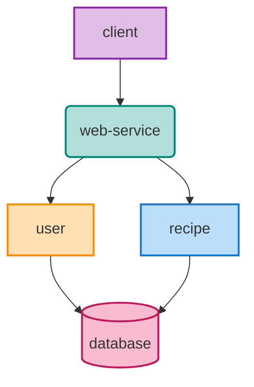

# Recipe Sharing Description and Setup

This document describes the recipe-sharing project, its architecture, and how to run it locally.

## Assumptions

- Users can see other users' recipes but not change them.
- I should not care about other non-functional requirements like logging and monitoring.

## Application Architecture
My goal in this section is to explain my thought process clearly and explain the structure of the project.

When creating a new application, I consider its growth, maintainability, and testability potential. This led
me to choose DDD, hexagonal (or port-adapter) architecture, and backend-4-frontend pattern for the
recipe-sharing project. These architectural choices prioritize code structure and maintainability.

DDD helps structure complex software applications into different domains, dividing a complex problem into
smaller and simpler components. DDD shapes the application to the user's needs and establishes a common
vocabulary between developers, product owners, and users. The hexagonal architecture helps us maintain each
domain's anti-corruption layer, allowing us to separate concerns. Following, there is a brief
explanation of how DDD fits into the recipe-sharing world:

- I separated the recipe-sharing application into two domains: user and recipe.
- A user can register and log in.
- Registering a user requires StrongPassword, EmailString, and Username value objects.
- The user domain has a User entity.
- A recipe has an owner and ingredients.
- A user who creates or modifies a recipe is the owner of that recipe.
- The recipe domain has the Recipe and Ingredient entities.
- The RecipeAggregate handles the logic of managing recipes and ingredients and ensures consistency.
- The repositories provide access to entities or aggregates.
- The services contain additional business logic that doesn't fit into aggregates.

The backend-4-frontend pattern is a way to consolidate the logic provided for a specific frontend. This pattern allows
us to create a backend tailored to the frontend's needs, providing only the necessary data and operations.
In this case, I assumed the frontend would be a web application.

All these benefits don't come without a price, which is complexity. The following section describes the general structure of this project.

### Application Structure

I created a multi-module project to separate the concerns of the application.

- The core module has classes, validations, extensions, and exceptions common to the modules.
- The user module contains the user's functionality, such as registration, login, and reading user data.
- The recipe module contains the logic for CRUD operations for recipes and ingredients.
- The web service module contains the REST APIs and the application's configuration. It is also a way to
prevent cyclic dependencies between the modules.

Each module follows this packaging structure:

- I created the package `net.azeit.recipesharing` following standard naming conventions.
- Inside, I created packages `application`, `domain`, and `infra`.
- The `infra` package contains the application configurations and components for retrieving
  or exposing data (clients to external services or the API).
- The `domain` package contains the core logic of the domain.
- The `application` package contains the services exposing the functionality of the domain to the outside.

> Note that the `web-service` module only has the infra package, with configurations and the API layer.

I also decided to include other configurations to facilitate maintainability. These are:
- Gradle `testFixtures` for shared test code.

## Testing

- The `user` and `recipe` modules have its unit tests to cover the main functionalities.
- The `web-service` module has  integration tests checking inputs and outputs of the endpoints.
- Overall, I tried to not duplicate tests.

## Time Limitation Decisions - Possible Improvements

- The Visual Crossing clients' implementation could be placed in a separate module to decouple the code further.
- The database could be separated in different schemas (user and recipe schemas).
- Secrets and API keys should be encrypted and passed as environment variables.
- Use Gradle version catalog
- I used JPA for the database because it is faster to implement. Otherwise, I had to do a lot
  of manual work to map the database response to the objects. Many developers prefer JDBC because it gives them more
  control over the database, and you don't have the possible N+1 Problem. However, it is more time-consuming to implement.
- Search endpoints normally should be paginated and sorted.

## How to Run Locally

You can easily run the application following these steps:

1. Make sure you have Docker, Docker Compose and Java 21.
2. Paste the `recipe-sharing.visualcrossing.api-key` in the `application.properties` file.
3. Execute the command `make clean test` that will create the jar file and run the tests.
4. Execute the command `docker compose up` in the root directory. This will create two
containers: one for the application and one for the database.
5. Go to http://localhost:8080/swagger-ui/index.html to see the API documentation.

## The Future

Imagining how a new application will mature and scale is essential when creating it. This can
facilitate future splits or decommissioning by you or other developers, and having a modular application helps
with this process. For example, let's say that after a couple of years, the functionality has grown, and we want
to split these applications: one for the user's domain, managed by a team, and the other for the recipe domain,
managed by another team. A possible outcome would be:

- The core module becomes a library.
- The user module becomes an application, and we include the REST endpoints related to the user domain.
- The recipe module becomes an application, and we include the REST endpoints related to the recipe domain.
- Assuming we do not change the API layer, we can incrementally redirect the traffic from the old app to the new services.

Migrations are complex, and this example is an oversimplification. However, I want to depict the advantages of already
having the application separated by modules, in contrast to having everything together in one single module.

## Open Questions

- "Ingredients (required, comma-separated values)" I didn't quite understand what this meant.
